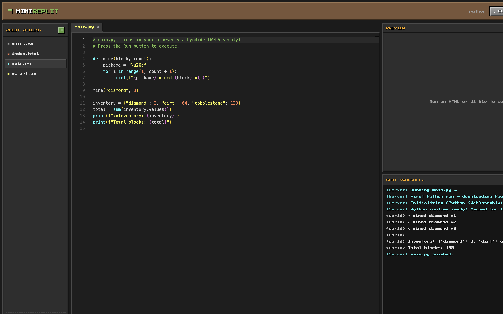
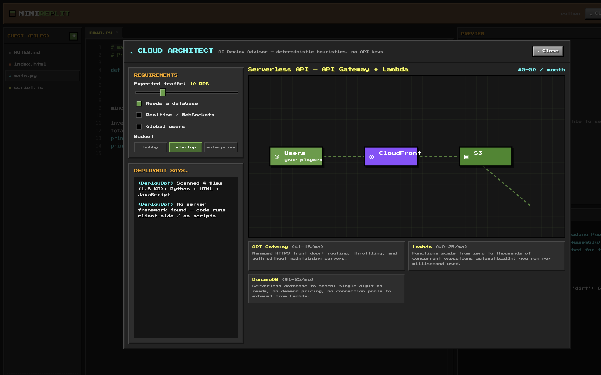
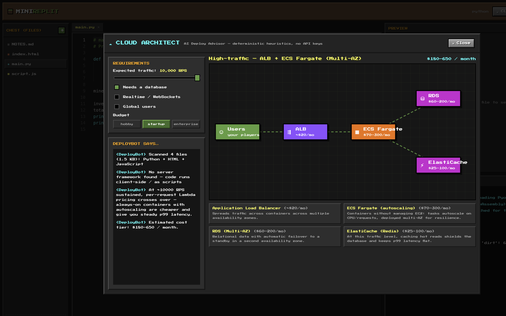

# ⛏ Mini-Replit — a Minecraft-Themed Browser IDE

**Live demo:** https://virum9520.github.io/mini-replit/
**Access password:** `For_Replit`

A Replit-inspired IDE that runs **entirely in the browser** — Monaco editor,
real Python and JavaScript execution, and an AI-style **Cloud Architect** that
designs AWS architectures live as you tweak requirements. All of it skinned as
a Minecraft server, because side projects should be fun to open.



---

## Highlights

- **A real IDE loop, no backend anywhere.** File tree, editor tabs, a Run
  button, a console, and a deployments advisor — served as static files from
  GitHub Pages, yet it executes real CPython and sandboxed JavaScript.
- **TypeScript + React throughout**, with an emphasis on making code execution
  feel instant.
- **Explainable "AI".** The Cloud Architect looks like an AI advisor but is a
  deterministic heuristics engine — every recommendation is reproducible, and
  it works on a static host forever with no API keys.

## How code execution works

**JavaScript / HTML** — the workspace is compiled into a single self-contained
document: local `<script src>` and stylesheet references are inlined from the
in-memory file system, a console shim is injected, and the result is rendered
in an iframe with `sandbox="allow-scripts"` (no same-origin access). The shim
forwards `console.*` calls, runtime errors, and unhandled rejections to the
host app via `postMessage`, where they render in a Minecraft-chat-styled
console.

**Python** — [Pyodide](https://pyodide.org) (CPython compiled to WebAssembly)
is lazy-loaded from the CDN on the first run (~10 MB, cached for the session),
so users who never run Python never pay for it. Workspace `.py` files are
written into Pyodide's in-memory filesystem so local imports work, and
stdout/stderr are piped straight into the console pane.

**Persistence** — the workspace lives in `localStorage` with starter templates
(Python, HTML/JS, notes), so edits survive reloads with zero infrastructure.

## The Cloud Architect ("AI Deploy Advisor")

The differentiator. Open **☁ Cloud Architect** in the header and the advisor:

1. **Analyzes your workspace** — languages, total size, and server-ish signals
   (Flask/FastAPI/Django/Express imports, `app.listen`, WebSocket servers…).
2. **Takes your requirements** — a log-scale traffic slider (1 → 10,000 RPS),
   toggles for database / realtime / global users, and a budget tier.
3. **Recommends an AWS architecture** and renders it as a live SVG diagram
   that **morphs** as you move the sliders:
   - Static site → **S3 + CloudFront**
   - Low-traffic API → **API Gateway + Lambda + DynamoDB**
   - High traffic → **ALB + ECS Fargate + RDS + ElastiCache**, Multi-AZ
   - Global users → **Route 53 + CloudFront + second-region replica**
4. **Explains itself** — chat-style reasoning lines, a per-component "why",
   and a monthly cost tier for every recommendation.

A low-traffic app with a database gets a serverless design:



Drag the traffic slider to 10,000 RPS and the same app is re-architected onto
containers with a load balancer, Multi-AZ RDS, and a cache — with DeployBot
explaining why per-request Lambda pricing stops making sense:



## Tech stack

| Layer | Choice |
| --- | --- |
| Framework | Vite + React 18 + TypeScript |
| Editor | Monaco via `@monaco-editor/react`, custom Minecraft theme |
| Python runtime | Pyodide (WebAssembly), lazy-loaded from CDN |
| JS sandbox | `iframe[sandbox=allow-scripts]` + `postMessage` console bridge |
| Styling | Hand-written CSS — "Press Start 2P" font, beveled panels, dirt/stone/grass palette |
| CI/CD | GitHub Actions → GitHub Pages on every push to `main` |

## Running locally

```bash
npm install
npm run dev     # http://localhost:5173/mini-replit/
npm run build   # type-check + production build
```

Password on the gate: `For_Replit` (client-side only — it's an access gate,
not security).

## Project structure

```
src/
  components/     PasswordGate, Ide, FileTree, ConsolePane, CloudArchitect
  runner/         webRunner (iframe builds), pythonRunner (Pyodide)
  architect/      heuristics engine + morphing SVG diagram
  hooks/          useWorkspace (localStorage-backed file system)
  workspace.ts    starter templates + persistence
```

---

*Not affiliated with Mojang or Replit — a fan-made project.*
